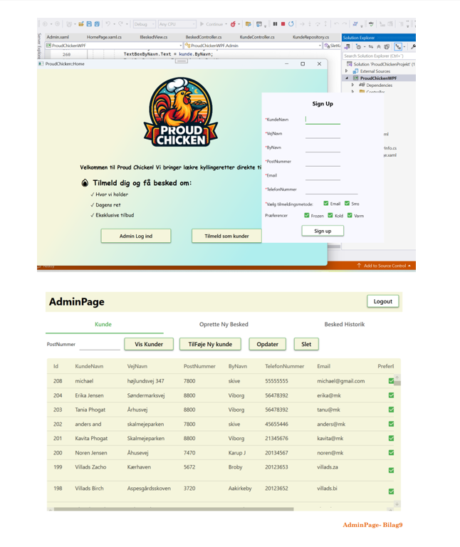

ProudChicken Notification Management System.
A C#-based SMS and Email management system developed for ProudChicken foodtruck to handle customer notifications about locations, promotions, and time-limited offers. The project began as a Console application for core functionality and was later implemented in WPF using an MVC architecture.
## 🖼 Screenshot

